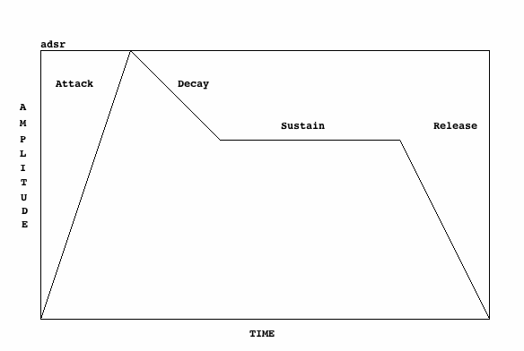
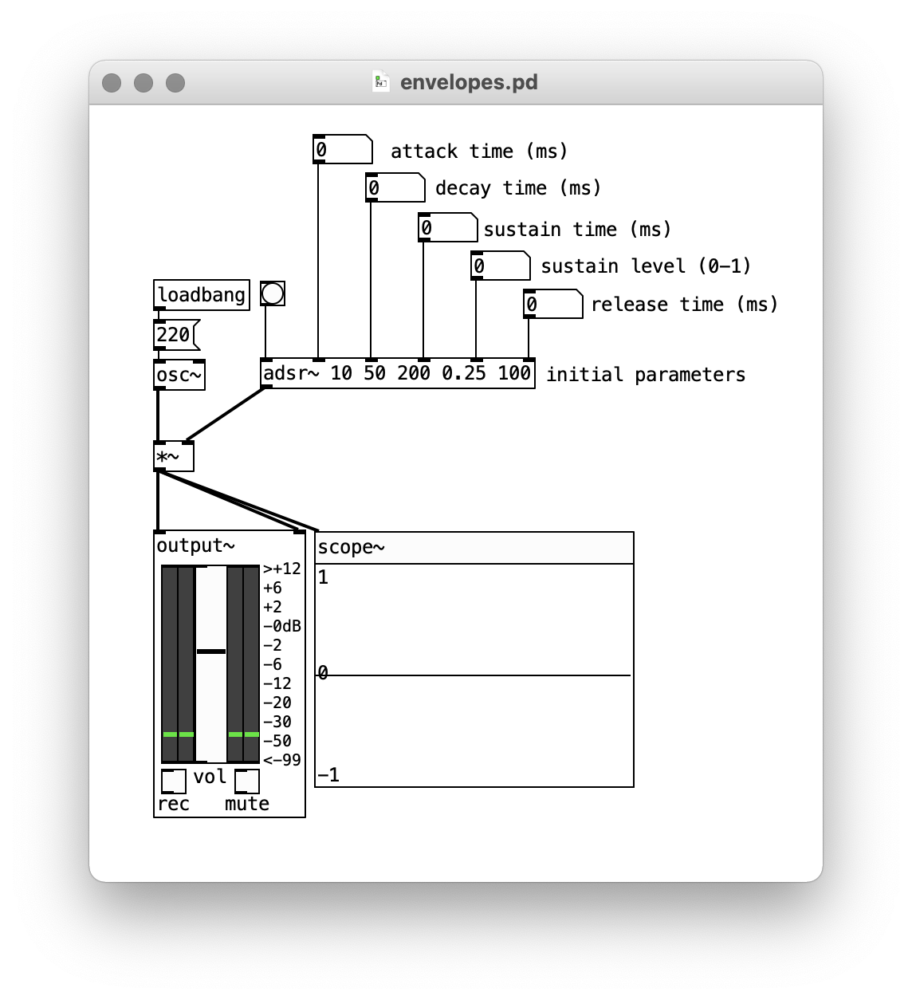
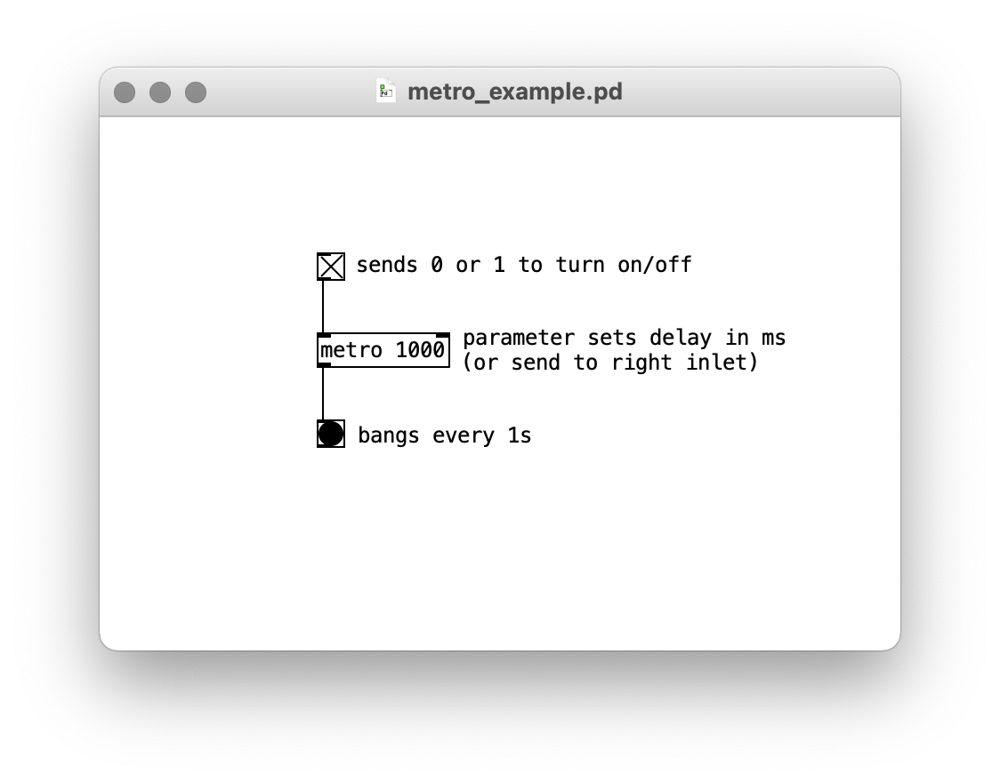
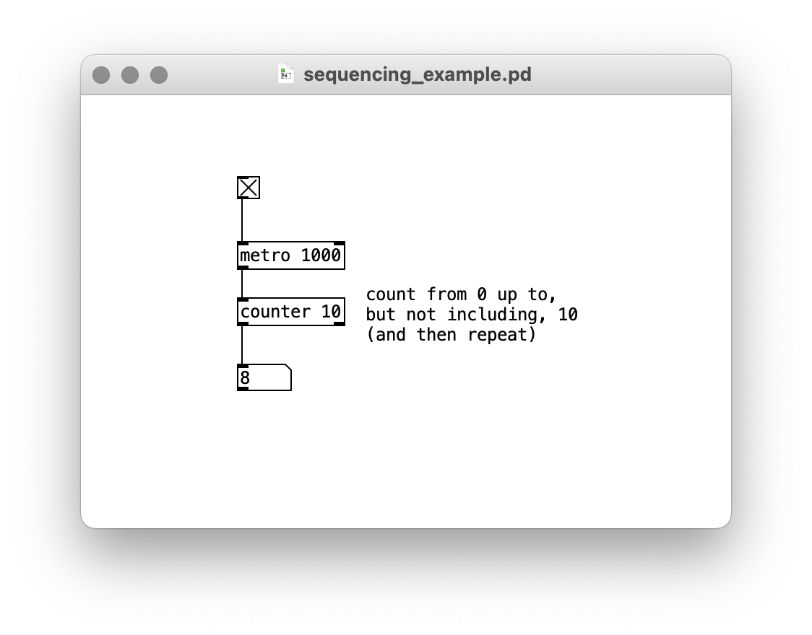
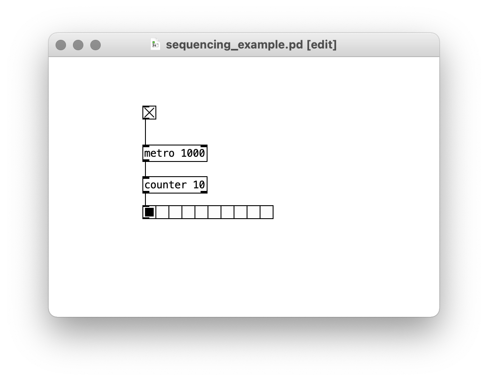
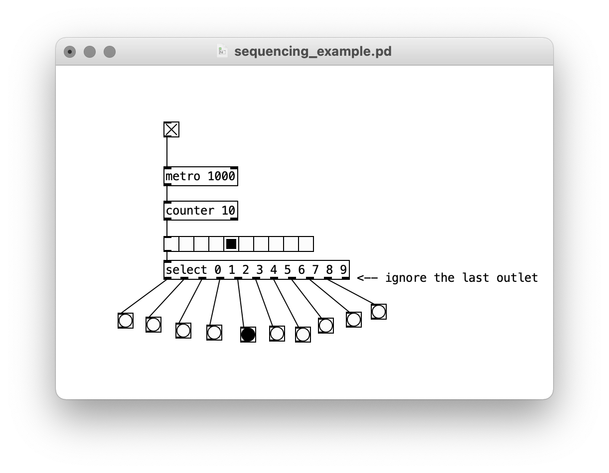
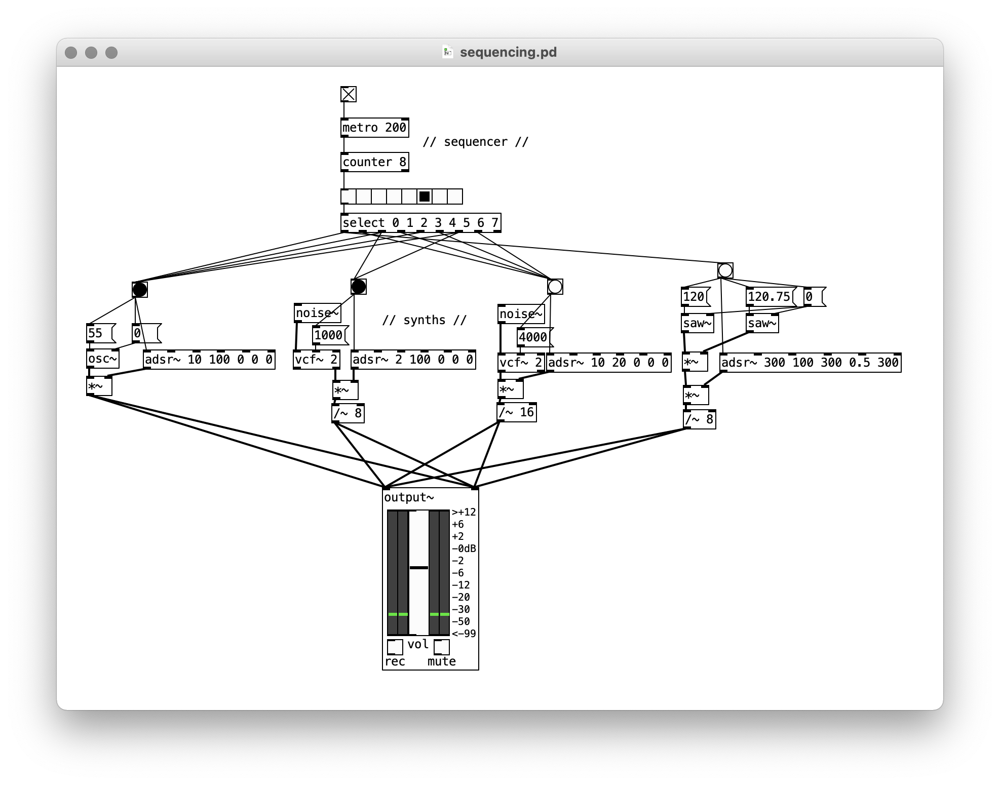

# Envelopes, Real-time Sequencing, and Spatialization

Last time we covered the fundamentals of what we can do with waveforms in Pd. Now we're going to explore how we can organize those sounds in time in ways other than oscillation.

## Envelopes

Sound events in the physical world often have a shape to them. There might be an initial strike, tone, or impact, followed quieter section as a vibrating body comes to rest.

In electronic sound, we shape that characteristic through **amplitude envelopes**. This is simply a description of how the amplitude of a sound changes over time. The most typical configuration for an envelope, which you'll see all over the place on synthesizers and software instruments, is a four-stage sequence known as ADSR:

- **(A)ttack**: the length of time it takes the sound to reach its loudest point
- **(D)ecay**: the length of time after the attack it takes the sound to reach its sustain amplitude
- **(S)ustain**: the length of time the sound is held (often determined by a piano key), and at what amplitude
- **(R)elease**: the length of time after the sustain it takes the sound to fade to silence

In Pd, we can define an envelopes with the `adsr~` Object (one of our pre-built externals, which uses `vline~` internally):

By multiplying any continuous signal with the `adsr~` signal, we can produce discrete sound events with very different characters. Experiment with how each parameter changes the sound.

Note that no sound is produced until the envelope is triggered using a "bang". This has important implications for our next topic.

## Real-time sequencing

With static audio files in Audacity, we sequenced audio segments by splicing them and moving them on the timeline. There is no timeline in Pd, and all the sounds are being generated "real-time". We've already seen how to use LFOs to create change over time, but we can also trigger events using timers, bangs, and envelopes.

Perhaps the most important object for sequencing is `metro` aka "metronome". `metro` outputs a bang every N milliseconds. To start a `metro`, we have to send it a 1, and to stop it, we send a 0. An easy way to do this is with a toggle object (both bangs and toggles are available from the "Put" menu):

To take things a step further, we can add a counter. This Object will count the number of bangs it receives, up to but not including the parameter given as a default value or sent to its right inlet.

A more interesting display than a number box is HRadio, which is available from the Put menu. Since my counter goes to 10, I've had to go into the properties on the HRadio and increase the number of cells from the default 8.

Next, we add a `select` object. `select` compares an input to its inlet with the numbers or symbols given to it as parameters. If the input matches one of them, the corresponding outlet gets a bang. (Note that the final outlet on `select` is just the input if the input doesn't match any of the specified options).

Since our counter has 10 steps, it outputs values from 0 to 9. `select` takes that number, and bangs the appropriate step.

From here, we could connect those bangs to envelope generators to play sounds, or use them to send messages with frequency values to oscillators, or both.

Here's a more developed example to show how that might look:

## random

## panning

## reverb
