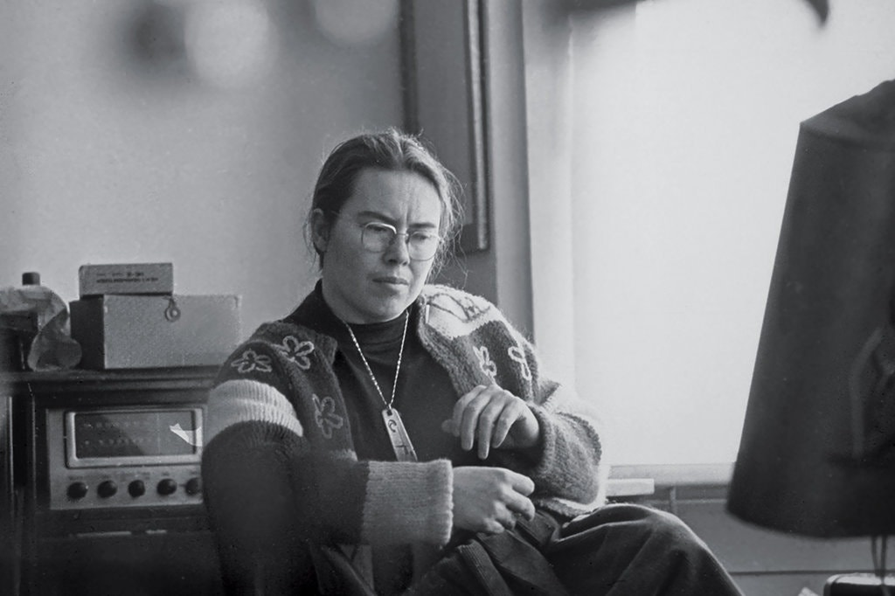

# Brandon Labelle

(did they post? clarify that if not)

[Rehearsal for a People's Microphone](media/labelle_rehearsal.mp4) (2013 , Quebec)
<!-- pre Eric Garner and George Floyd -->

The work appropriates the device of a people's microphone to talk about the condition of the voice in public space and to "rehearse" protest

- a sound artist known for his theoretical writings
- grew up in Los Angeles and was a drummer in punk bands
- got his MFA at CalArts and began doing working with sound as material, particularly interested in the voice
- in the 90s in California and then moving to Berlin, he edited an arts-and-literature magazine called [_Errant Bodies_](https://www.errantbodies.org) which developed ideas of listening, collective practice, and noise

Sound is always in more than one place

What is relationality?
- to affect (as a noun, a change in the condition of the body, a pre-emotion)

Labelle makes three main points
- sound is a "spatial event" which reverberates through the room (architectural)
- sound is inherently social (in the very physical sense of bodies)
- listening is a form of participation (mental reverberation -> cultural meaning)

Sound art is
- the "activation of the existing relation between sound and space"
